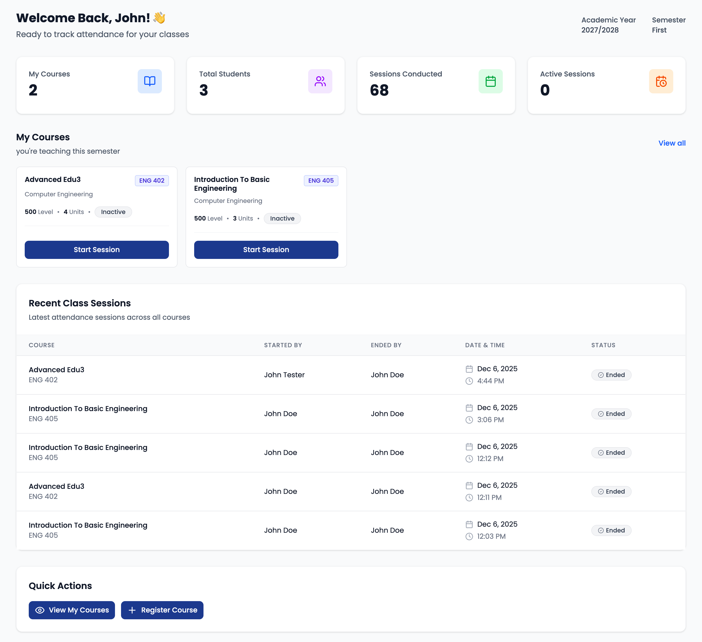
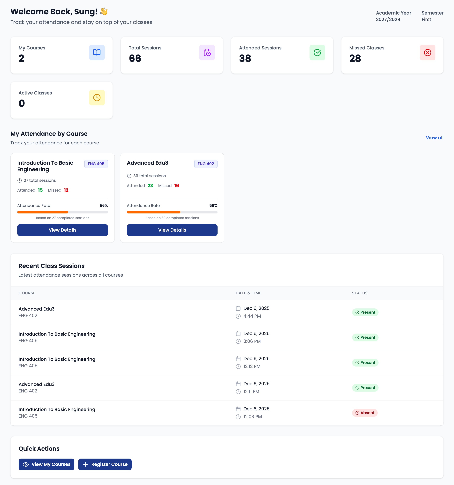
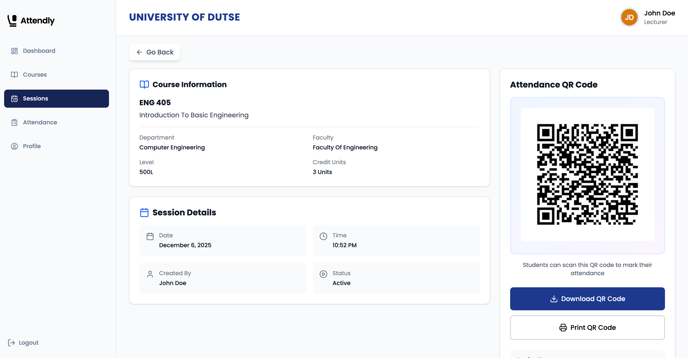
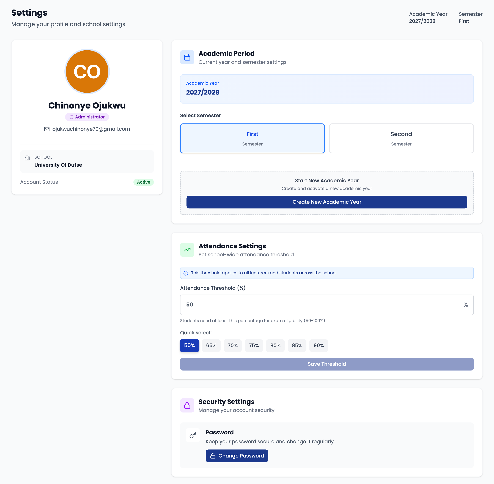
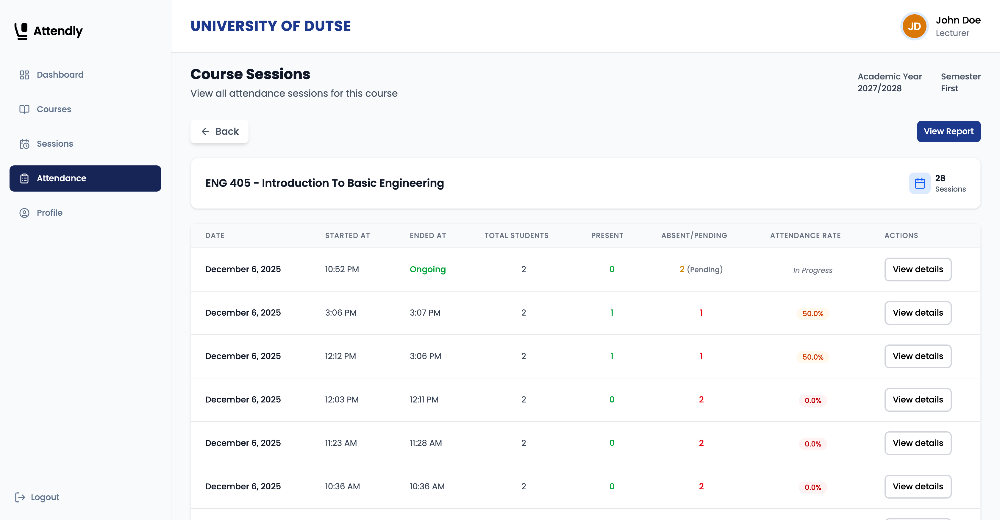
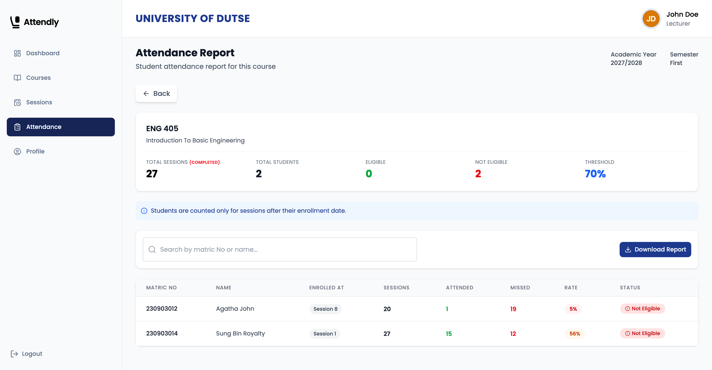

# 🎓 Attendly - Smart Attendance Management System

> A full-stack attendance management platform built for educational institutions, featuring QR code scanning, role-based access control, and comprehensive reporting.

[](https://attendly-oi6i.onrender.com/)
[](https://github.com/4002-Nonye/attendly)


*Dashboard showing real-time attendance analytics*

---

## 📑 Table of Contents
- [Overview](#-overview)
- [Key Features](#-key-features)
- [Screenshots](#-screenshots)
- [Tech Stack](#️-tech-stack)
- [Quick Start](#-quick-start)
- [Test Accounts](#-test-accounts)
- [Technical Highlights](#-technical-highlights)
- [Complete Feature List](#-complete-feature-list)
- [Roadmap](#-roadmap)
- [Author](#-author)
- [License](#-license)
- [Contact & Feedback](#-contact--feedback)

---

## 📋 Overview

Attendly is a production-ready attendance system designed to streamline attendance tracking in universities and colleges. Built with modern web technologies, it handles everything from QR code-based attendance marking to detailed analytics and reporting.

**🚀 [View Live Demo](https://attendly-oi6i.onrender.com/)**

> **Note:** This is V1, designed for global user testing. V2 will include geofencing, device fingerprinting, and bulk import features based on user feedback.

---

## ✨ Key Features

### 🔐 Complete Authentication System
- **Email/Password Authentication** - Secure signup and login with JWT
- **Google OAuth 2.0** - One-click sign-in with Google
- **Account Linking** - Seamlessly link OAuth and email accounts
- **Password Reset** - Forgot password with email token
- **Change Password** - In-app password updates
- **Role-Based Access Control** - Admins, Lecturers, and Students with distinct permissions

### 📱 Attendance Management
- **QR Code Scanning** - Students scan unique QR codes to mark attendance instantly
- **Manual Marking** - Fallback button-based attendance marking
- **Real-Time Sessions** - Live attendance tracking during active classes
- **Session History** - View detailed attendance records for each session
- **Automatic Absence Marking** - Students who don't attend are automatically marked absent when session ends

### 👥 Multi-Lecturer Support
- **Collaborative Teaching** - One course can have multiple lecturers assigned
- **Self-Assignment** - Lecturers can assign/unassign themselves to courses
- **Individual Thresholds** - Each lecturer can set custom attendance thresholds per course
- **Session Ownership** - Track which lecturer started each session

### 📊 Analytics & Reporting
- **Real-Time Dashboards** - Role-specific dashboards with live data
- **Weekly Charts** - Visualize attendance trends with Recharts
- **Department Analytics** - Admin can view attendance breakdown by department
- **School-Wide Stats** - Institution-level attendance overview
- **PDF Export** - Download comprehensive attendance reports
- **Eligibility Tracking** - Automatic exam eligibility calculation based on thresholds

### 🎓 Academic Management
- **School Creation** - Admins create schools on signup
- **Academic Year Setup** - Create and manage academic years
- **Automatic Promotion** - Students auto-promoted when new academic year is created
- **Semester Switching** - Navigate between semesters to view historical data
- **Faculty & Department Management** - Hierarchical institution structure
- **Course Management** - CRUD operations for courses with level-based filtering

### 📝 Enrollment System
- **Self-Enrollment** - Students enroll in courses for their level
- **Bulk Enrollment** - Select multiple courses and enroll at once
- **Unenrollment** - Students can drop courses
- **Enrollment Verification** - Only enrolled students can mark attendance
- **Mid-Semester Enrollment** - Attendance calculated from enrollment date forward

### 🎨 User Experience
- **Responsive Design** - UI that works on all devices
- **Search & Filters** - Find courses, students, sessions quickly
- **Loading States** - Skeleton screens for better perceived performance
- **Toast Notifications** - Real-time feedback for user actions
- **Empty States** - Helpful messages when no data exists
- **Protected Routes** - Role-based route guarding

---

## 📸 Screenshots

### Dashboard Views

*Admin dashboard with school-wide analytics and weekly charts*


*Lecturer dashboard*


*Student dashboard*

### QR Code Attendance

*Lecturer generates unique QR code for each session*

### Admin Settings & Configuration

*Admin configures academic year, semester, and default attendance threshold*

### Reports & Analytics

*Detailed sessions held for a course*


### Reports & Analytics

*Detailed attendance report with PDF export option*


---

## 🛠️ Tech Stack

### Frontend
- **React** - Modern UI library with hooks
- **React Router** - Client-side routing with nested routes
- **TanStack Query** - Powerful data fetching, caching, and state management
- **Tailwind CSS** - Utility-first styling with JIT compiler
- **Recharts** - Composable charting library for data visualization
- **React Hook Form** - Performant form handling with validation
- **Axios** - Promise-based HTTP client
- **Lucide React** - Beautiful & consistent icon library
- **React Hot Toast** - Lightweight toast notifications

### Backend
- **Node.js + Express** - Fast, minimalist web framework
- **MongoDB + Mongoose** - NoSQL database with elegant ODM
- **JWT (jsonwebtoken)** - Secure token-based authentication
- **Passport.js** - Google OAuth 2.0 integration
- **PDFKit** - Dynamic PDF generation for reports
- **QRCode** - Server-side QR code generation
- **Nodemailer** - Email sending (password reset, verification)
- **Bcrypt** - Password hashing with salt rounds
- **Cookie-Parser** - Parse HTTP cookies
- **CORS** - Cross-origin resource sharing
- **Day.js** - Lightweight date manipulation

### DevOps & Tools
- **Render** - Cloud hosting for both frontend and backend (monorepo)
- **UptimeRobot** - 24/7 uptime monitoring (5-min intervals)
- **Concurrently** - Run multiple npm scripts simultaneously
- **Nodemon** - Auto-restart server on file changes
- **ESLint** - Code linting and formatting
- **Git/GitHub** - Version control and collaboration

---

## 🚀 Quick Start

### Prerequisites
- **Node.js** v18 or higher ([Download](https://nodejs.org/))
- **MongoDB** v6 or higher ([Atlas](https://www.mongodb.com/cloud/atlas) or local)
- **npm** or **yarn**

### Installation

1. **Clone the repository**
```bash
git clone https://github.com/4002-Nonye/attendly.git
cd attendly
```

2. **Install dependencies for both frontend and backend**
```bash
# Install backend dependencies
cd server
npm install

# Install frontend dependencies
cd ../client
npm install
```

3. **Set up environment variables**

Create `.env` in the `server` directory:
```env
PORT=5000
MONGO_URI=your_mongodb_connection_string
JWT_SECRET=your_super_secret_jwt_key
CLIENT_URL=http://localhost:5173
NODE_ENV=development

# Email Configuration (for password reset)
EMAIL_USER=your_email@gmail.com
EMAIL_PASS=your_gmail_app_password

# Google OAuth (Optional - for Google sign-in)
GOOGLE_CLIENT_ID=your_google_client_id
GOOGLE_CLIENT_SECRET=your_google_client_secret
```

Create `.env` in the `client` directory:
```env
VITE_API_URL=http://localhost:5000
```

4. **Run the application**

From the `server` directory, run both frontend and backend concurrently:
```bash
npm run dev
```

This will start:
- ✅ Backend API server on `http://localhost:5000`
- ✅ Frontend dev server on `http://localhost:5173`

**Alternative:** Run them separately in different terminals:
```bash
# Terminal 1 - Backend
cd server
npm run server

# Terminal 2 - Frontend
cd client
npm run dev
```

5. **Access the application**

Open your browser and visit **`http://localhost:5173`**


---
## 🧪 Test Accounts

Want to explore the live demo without signing up? Use these test accounts:

**Admin Account**
- Email: `admin@attendly.com`
- Password: `Test@1234`

**Lecturer Account**
- Email: `lecturer@attendly.com`
- Password: `Test@1234`

**Student Account**
- Email: `student@attendly.com`
- Password: `Test@1234`

> ⚠️ **Note:** These are shared test accounts. Data may be modified by other users. For a personalized experience, please create your own account.

---


## 💡 Technical Highlights

### Complex Challenges Solved

#### 1. **OAuth + Email Auth Account Linking**
**Problem:** Users signing up with email/password then trying Google OAuth caused duplicate accounts and confusion.

**Solution:** Implemented consent-based account linking flow:
- Detect existing accounts by email during OAuth
- Prompt user to link accounts securely
- Merge authentication methods while preserving user data
- Allow users to switch between auth methods seamlessly

---

#### 2. **Post-Enrollment Attendance Calculation**
**Problem:** Students enrolling mid-semester were unfairly penalized for sessions held before their enrollment date.

**Solution:** Built MongoDB aggregation pipeline that:
- Filters sessions by enrollment timestamp
- Calculates attendance percentage only from applicable sessions
- Preserves historical data integrity
- Updates in real-time as new sessions are held
```javascript
{
  $match: {
    $expr: {
      $and: [
        { $eq: ['$course', '$$courseId'] },
        { $gte: ['$createdAt', '$$enrollmentDate'] }  // Only sessions after enrollment
      ]
    }
  }
}
```

---

#### 3. **School Verification During Signup**
**Problem:** Ensuring students/lecturers select valid schools without manual admin approval, while preventing invalid/fake school entries.

**Solution:** 
- Dynamic dropdowns populated from backend with real-time school data
- Schools fetched via API call during signup
- Client-side validation ensures selection from valid options only
- Prevents SQL injection and invalid data entry
- Smooth UX without additional verification steps

---

#### 4. **Optimized Multi-Collection Queries**
**Problem:** Attendance reports required joining 5+ collections (Users, Courses, Sessions, Enrollments, Attendances), resulting in slow query times (~2 seconds).

**Solution:** 
- Leveraged MongoDB aggregation pipelines with `$lookup` stages
- Indexed frequently queried fields (courseId, studentId, sessionId)
- Reduced query time to **<200ms** for reports with 100+ students
- Implemented projection to return only necessary fields
- Used `$facet` for parallel aggregation operations
```javascript
// Example aggregation pipeline
db.students.aggregate([
  { $lookup: { from: "enrollments", ... } },
  { $lookup: { from: "attendances", ... } },
  { $group: { _id: "$studentId", totalAttended: { $sum: 1 } } }
])
```

---

#### 5. **State Management Across Nested Routes**
**Problem:** Managing filters, search queries, and pagination state across complex nested attendance routes (`/attendance/course/:id/session/:sessionId`).

**Solution:**
- **React Query** for server state (auto-caching, invalidation, refetching)
- **Custom hooks** (`useFilters`, `useSearchQuery`, `useSelection`) for UI state
- **URL-synced state** - filters persist in query params, enabling shareable links
- **Optimistic updates** for instant UI feedback
- **Stale-while-revalidate** strategy for fast perceived performance

---

#### 6. **Concurrent Session Prevention**
**Problem:** Multiple lecturers starting sessions for the same course simultaneously caused data conflicts and duplicate active sessions.

**Solution:**
- Atomic database checks with session status validation
- Backend middleware prevents race conditions
- `findOne({ course: courseId, status: 'active' })` check before creation
- Clear error messages to lecturers if session already active
- Mutex-like behavior without complex locking
```javascript
const existingSession = await Session.findOne({
  course: courseId,
  status: 'active'
});

if (existingSession) {
  return res.status(400).json({ error: 'Active session already exists' });
}
```

---

#### 7. **Secure QR Code Implementation**
**Problem:** QR codes could be screenshot and shared among students, enabling attendance fraud at scale.

**Solution (V1):**
- Unique hex tokens per session
- Tokens tied to specific sessionId (not reusable)
- Server-side validation checks session status (must be 'active')
- Tokens automatically invalidated when session ends
- One-time attendance per student per session

**V2 Enhancements:**
- Device fingerprinting to detect multiple scans from same device
- Geofencing to restrict marking to campus boundaries
- IP tracking to flag suspicious patterns (10+ students from same IP)

---

#### 8. **Academic Year Transitions & Student Promotion**
**Problem:** Manually promoting 1000+ students to the next level during academic year transitions risked data loss and was time-intensive.

**Solution:**
- Automated bulk promotion system triggered on new academic year creation
- Preserves historical attendance records (immutable by design)
- Updates student levels in bulk with transaction safety
- Maintains referential integrity across all collections
- Rollback mechanism in case of failures
```javascript
// Simplified promotion logic
await User.updateMany(
  { role: 'student', level: { $lt: maxLevel } },
  { $inc: { level: 1 } }
);
```

---

#### 9. **Multi-Role Dashboard Complexity**
**Problem:** Admins, lecturers, and students require completely different dashboards, data views, and permissions.

**Solution:**
- **Route-based protection** with nested `<ProtectedRoute>` components
- **Role-specific API endpoints** with middleware validation (`requireAdmin`, `requireLecturer`)
- **Reusable components** with role-based conditional rendering
- **Separate data fetching hooks** per role (`useAdminStats`, `useLecturerStats`, `useStudentStats`)
- **Dashboard component composition** for DRY code


---

## 📱 Complete Feature List

### Authentication & Authorization 🔐

- ✅ **Email/Password Registration** - Secure signup with bcrypt password hashing
- ✅ **Email Verification** - Verify email addresses via token link
- ✅ **Login System** - JWT-based authentication with httpOnly cookies
- ✅ **Google OAuth 2.0** - One-click sign-in with Google accounts
- ✅ **Account Linking** - Seamlessly merge OAuth and email accounts
- ✅ **Forgot Password** - Email-based password reset with expiring tokens
- ✅ **Reset Password** - Secure password update via email link
- ✅ **Change Password** - In-app password updates
- ✅ **Role-Based Access Control** - Admin, Lecturer, Student roles with distinct permissions
- ✅ **Protected Routes** - Client-side route guarding based on user role
- ✅ **Session Management** - Automatic token refresh and logout on expiry

---

### For Admins 👔

#### School & Structure Management
- ✅ **School Creation** - Create school during admin signup
- ✅ **Academic Year Setup** - Create and manage academic years
- ✅ **Semester Management** - Switch between semesters to view data
- ✅ **Faculty Management** - Create, edit, delete faculties
- ✅ **Department Management** - Manage departments under faculties
- ✅ **Course Management** - Full CRUD for courses with level-based organization
- ✅ **Lecturer Management** - View, add, edit, remove lecturers
- ✅ **Student Management** - View, edit, remove students

#### Analytics & Reporting
- ✅ **School-Wide Dashboard** - Total students, lecturers, courses, faculties
- ✅ **Weekly Attendance Charts** - Visualize institution-wide attendance trends
- ✅ **Department-Level Analytics** - Attendance breakdown by department
- ✅ **PDF Report Export** - Download comprehensive attendance reports
- ✅ **Threshold Configuration** - Set default attendance threshold for school
- ✅ **Historical Data Access** - View data from previous semesters

#### Search & Filters
- ✅ **Global Search** - Find courses, students, lecturers, departments
- ✅ **Multi-Level Filters** - Filter by faculty, department, level
- ✅ **Bulk Actions** - (Future: Bulk delete, export)

---

### For Lecturers 👨‍🏫

#### Course Management
- ✅ **Self-Assignment** - Assign/unassign yourself to courses
- ✅ **Course Overview** - View all assigned courses with stats
- ✅ **Multi-Lecturer Support** - Collaborate with other lecturers on same course
- ✅ **Threshold Override** - Set custom attendance threshold per course

#### Session Management
- ✅ **Start Session** - Create attendance session with one click
- ✅ **QR Code Generation** - Unique QR code generated per session
- ✅ **Active Session Monitoring** - View real-time attendance as students mark
- ✅ **End Session** - Close session and auto-mark absent students
- ✅ **Session History** - View all past sessions with attendance data
- ✅ **Session Details** - See which students attended/missed specific sessions

#### Reporting & Analytics
- ✅ **Course Dashboard** - Attendance stats for each assigned course
- ✅ **Weekly Charts** - Visualize attendance trends over time
- ✅ **Student Attendance List** - View each student's attendance record
- ✅ **PDF Export** - Download course-specific attendance reports
- ✅ **Eligibility Tracking** - See which students are below threshold

---

### For Students 🎓

#### Enrollment
- ✅ **Self-Registration** - Sign up and select school from dropdown
- ✅ **Profile Completion** - Add matric number, level, department
- ✅ **Course Enrollment** - Browse and enroll in courses for your level
- ✅ **Bulk Enrollment** - Select multiple courses and enroll at once (checkbox selection)
- ✅ **Unenrollment** - Drop courses you no longer wish to take
- ✅ **Enrollment Verification** - Only enrolled students can mark attendance

#### Attendance
- ✅ **QR Code Scanning** - Scan lecturer's QR code to mark attendance
- ✅ **Manual Marking** - Fallback button-based attendance (if QR fails)
- ✅ **Real-Time Feedback** - Instant confirmation when attendance is marked
- ✅ **One-Time Marking** - Cannot mark attendance twice for same session
- ✅ **Active Session Detection** - Only mark during active sessions

#### Tracking & Analytics
- ✅ **Student Dashboard** - Overview of all enrolled courses with attendance %
- ✅ **Course-Specific View** - See attendance breakdown for each course
- ✅ **Session History** - View all sessions (attended, missed, pending)
- ✅ **Eligibility Status** - Check if you're eligible for exams per course
- ✅ **Threshold Warnings** - Visual indicators when below attendance threshold
- ✅ **Real-Time Updates** - Attendance percentage updates as sessions are held

---

### System-Wide Features 🌐

#### Search & Filtering
- ✅ **Global Search** - Search across courses, sessions, students
- ✅ **Advanced Filters** - Filter by department, faculty, level, semester
- ✅ **URL-Synced Filters** - Shareable filtered views via query params
- ✅ **Real-Time Search** - Debounced search with instant results

#### UI/UX
- ✅ **Responsive Design** - Mobile, tablet, desktop optimized
- ✅ **Dark Mode Support** - (Future: Toggle between light/dark themes)
- ✅ **Loading States** - Skeleton screens for better perceived performance
- ✅ **Toast Notifications** - Real-time feedback for all actions
- ✅ **Empty States** - Helpful messages when no data exists
- ✅ **Error Handling** - User-friendly error messages with retry options
- ✅ **Form Validation** - Client & server-side validation with clear error messages

#### Data Management
- ✅ **PDF Export** - Generate printable attendance reports
- ✅ **CSV Export** - (Future: Export data to Excel)
- ✅ **Data Persistence** - All data stored in MongoDB with proper indexing
- ✅ **Audit Trail** - (Future: Track who changed what and when)

---

## 🔮 Roadmap (V2 & Beyond)

> **Current Version:** V1 - Designed for global user testing and feedback collection

### Planned Features for V2

#### 🔒 Security & Anti-Cheat
- **Geofencing** - Restrict attendance marking to campus boundaries (configurable radius)
- **Device Fingerprinting** - Prevent multiple accounts on same device
- **Attendance Window Limits** - Restrict marking to first X minutes of class

#### ⚙️ Admin Tools
- **Bulk CSV Import** - Upload faculties, departments, and courses via CSV
- **Bulk Student Import** - Pre-populate student lists with matric numbers
- **Bulk Lecturer Import** - Add entire faculty roster in one go
- **Academic Year Switching** - Navigate between different academic years

#### 📧 Notifications
- **Email Alerts** - Notify students when below threshold
- **Session Start Notifications** - Alert students when class begins

#### 🚀 Technical Improvements
- **TypeScript Migration** - Type safety across entire codebase

---

## 👤 Author

**Chinonye Ojukwu** - *Full-Stack Developer*

Passionate about building scalable web applications that solve real-world problems in education and beyond.

- 💼 LinkedIn: [Chinonye Ojukwu](https://www.linkedin.com/in/chinonye-ojukwu-51020023a/)
- 🐦 X (Twitter): [@that_reactdev](https://x.com/that_reactdev)
- 📧 Email: [ojukwuchinonye70@gmail.com](mailto:ojukwuchinonye70@gmail.com)
- 📱 GitHub: [@4002-Nonye](https://github.com/4002-Nonye)
- 🚀 Live Demo: [https://attendly-oi6i.onrender.com/](https://attendly-oi6i.onrender.com/)

---

## 📄 License

This project is licensed under the MIT License.

**Note:** Feel free to use this project for learning, but please credit the original author if you fork or adapt it.

---

## 🙏 Acknowledgments

- Inspired by the need to modernize attendance tracking in educational institutions across Africa and globally
- Built as a portfolio project showcasing full-stack development skills and real-world problem-solving
- Special thanks to the open-source community for amazing tools and libraries that made this possible
- Thanks to early testers who provided valuable feedback during V1 development

---

## 📞 Contact & Feedback

Have questions, suggestions, or found a bug?

- 📧 Email: [ojukwuchinonye70@gmail.com]
- 💼 LinkedIn: [Chinonye Ojukwu](https://www.linkedin.com/in/chinonye-ojukwu-51020023a/)
- 🐦 X (Twitter): [@that_reactdev](https://x.com/that_reactdev)
- 🐛 Issues: [Open an issue on GitHub](https://github.com/4002-Nonye/attendly/issues)
- 💬 Discussions: [GitHub Discussions](https://github.com/4002-Nonye/attendly/discussions)

**This is V1 - your feedback will directly influence V2 development!**

---

<p align="center">
  <strong>Built with ❤️ by Nonye</strong><br>
  <sub>Transforming education through technology, one attendance at a time.</sub>
</p>

<p align="center">
  <a href="https://attendly-oi6i.onrender.com/">Live Demo</a> •
  <a href="https://github.com/4002-Nonye/attendly/issues">Report Bug</a> •
  <a href="https://github.com/4002-Nonye/attendly/issues">Request Feature</a>
</p>